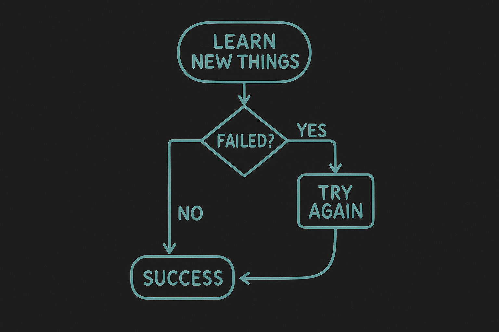

## Hi, ✨ I'm Helen ✨

  

🚀 **Curious developer | Lifelong learner | Builder of real projects**

I love turning ideas into real applications. Always curious and adaptable, I enjoy tackling challenges and continuously improving my skills.

**🛠️ Tech Stack**
- **Frontend:** React, HTML, CSS, Vanilla JavaScript
- **Backend:** Node.js, Express, C#, SQLite, MySQL
- **DevOps & Tools:** Docker & Docker Compose, GitHub Actions (CI/CD), DigitalOcean, Git, VS Code, IntelliJ, Postman

**🌱 Currently Exploring**
- Backend–Frontend architecture
- CI/CD pipelines
- Writing cleaner, more maintainable code

**🤹🏻‍♀️ Outside of coding**
- Playing video games
- Rollerskating and working out
- Watching movies and series
- Occasional nostalgic violin and flute playing
